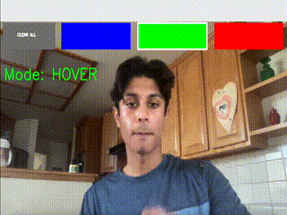
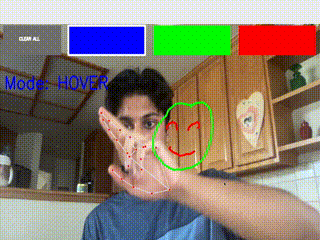

# Air Draw
This example is sped up just to show functionality, real-time examples shown below:
## Demo of Functionality

## Setup
<b>NOTE</b> This setup is just for what I use (Ubuntu 20.04). While I am willing to bet this will work for windows and unix, just be safe!
### Virtual environment
`python3 -m venv venv`
### Install Dependencies
`source ./venv/bin/activate`

`pip3 install -r requirements.txt`
### Run program
`python3 airdraw.py`

## Available Gestures

### Drawing

### Hovering

### Erasing

### Translation

## Why?
I've seen tons of attempts of this sort of thing with HSV masks and dying your fingers a certain color, and while it's more true to image processing that openCV caters for, I was sort of against letting our own styluses [go to waste](https://money.cnn.com/2015/09/10/technology/apple-pencil-steve-jobs-stylus/index.html).
Once I found out about [mediapipe](https://google.github.io/mediapipe/), I decided I would give this thing a shot! What you see is my attempt at materializing the idea, there is a more detailed [writeup](https://arefmalek.github.io/blog/Airdraw/) on my blog. 

## How?
Like I mentioned before, the ML workhorse here is definitely mediapipe. They've got awesome ML solutions so we can quickly gather data on the hand and use what we gather rather quickly. Other than that I pretty reliantly used OpenCV for image manipulation and NumPy for some basic dot products and because OpenCV uses numpy to represent images.

The conversion from hand data to lines / functionality is primarily done with some Python, basic linear algebra, and OpenCV. I'll leave the rest in the blog post. 

## What's next?
Definitely want to make this more available to everyone, so an upcoming goal will be to write this as a webapp, hopefully within the next month or so, I'll keep everyone posted :). 

Thanks for reading :)
